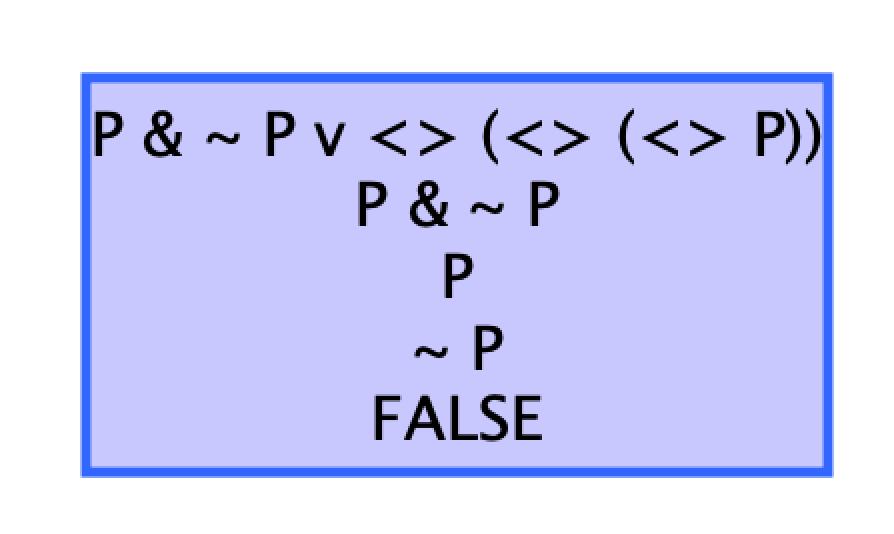

# LRC - TME 5
-----------------------
#### Ruizheng Xu 21111473  
-----------------------

**Comme je travaille sur MacOS, le logiciel ne peut pas exporter les fichier xml, donc je vais expliquer les démarches et les modèles que j'ai créé directement dans ce ficheir md.**

## Exercice 1

#### Question 1

Pour une formule donnée, en fonction de la stratégie utilisée, le logiciel va appliquer sur la formule toutes règles contenues dans les stratégies. Par exemple, pour la question 1, nous utilisons la stratégie `Model_Checking_Strategy`, qui contient les règles : 
- `ExampleOfModelAndFormula` qui sert à construire le monde
- `Top_Down_Strategy` qui sert à "split" la formule (par exemple `isItTrue and variable A variable B` sera séparée en `isItTrue variable A` et `isItTrue variable B`, et `isItTrue pos variable A` sera séparée en `isItTrue variable A` mais dans chaque monde accessible par le monde d'origine)
- `Bottom_Up_Strategy` sert alors à évaluer si `isItTrue variable A` est vraie, puis de remonter cette valeur résultante dans la formule de départ (avant Top_Down), et puis de déterminer la validité de la formule.

#### Question 2

Le modèle de Kripke M0 :

```
createNewNode w1
createNewNode w2
link w1 w2 R
link w1 w1 R
link w2 w2 R
add w1 Q
add w2 P
```

Pour tester si ce modèle M0 vérifie les contraintes :
- au moins un monde w où M0, w $\models$ $\neg$p $\wedge$ $\Box \Diamond$p
- au moins un monde où M0, w $\wedge$ $\Diamond^n$ $\neg$p

On ajoute les règles `add w1 isItTrue and not P nec pos P` et `add w1 isItTrue and Q pos pos pos not Q` pour observer si la valeur renvoyer à la fin est Yes ou pas.

|*premodels1*|
|:--:|
||

Et on voit bien que les résultats sont Yes. Donc les contraintes sont vérifiées.

#### Question 3

Pour définir l'opérateur **Implique**, on doit définier les règles de cet opérateur comme les autres opérateurs (and, or, ...), et d'intégrer ces règles dans les stratégies Top_Down_Strategy et Bottom_Up_Strategy.

Pour la règle dans Top_Down_Strategy, on doit séparer la formule d'implication en évaluation des variable A et B (car l'arité de l'opérateur est de 2), donc la règle est ainsi : 
```
Rule Imp_Top_Down
 hasElement w isItTrue imp variable A variable B

 add w isItTrue variable A
 add w isItTrue variable B
End
```

Ensuite, pour les règles de la stratégie Bottom_Up_Strategy, on doit savoir interpréter les différentes valeurs, et on sait que dans l'implication :
| A  | B  |  A $\rightarrow$ B |
|:-:|:-:|:-:|
| T | T | T |
| T | F | F |
| F | T | T |
| F | F | T |

Donc on peut différencier 3 cas :
   si la variable est F, alors la formule est T. 
   Si la variable B est T, alors la formule est T. 
   Et si la variable A est T **et** la variable B est F, alors la formule est F.

Donc au finale, obtient : 
```
Rule Imp_Left_Not_True_Bottom_Up
 hasElement w isItTrue imp variable A variable B
 isMarkedExpression w isItTrue variable A No

 markExpressions w isItTrue imp variable A variable B Yes
End

Rule Imp_Right_True_Bottom_Up
 hasElement w isItTrue imp variable A variable B
 isMarkedExpression w isItTrue variable B Yes

 markExpressions w isItTrue imp variable A variable B Yes
End

Rule Imp_Left_True_Right_Not_True_Bottom_Up
 hasElement w isItTrue imp variable A variable B
 isMarkedExpression w isItTrue variable A Yes
 isMarkedExpression w isItTrue variable B No

 markExpressions w isItTrue imp variable A variable B No
End
```

Et on teste la formule `P -> [] (Q v P)` :

|*premodels1*|
|:--:|
||

Et le résultat est bien ce qu'on attend, car dans le monde u, il n'y a ni P, ni Q, donc Q v P donnera F. Et dans le monde w, on a P, donc on a au final T -> F, qui donne F.

## Exercice 2

#### Question 1

Le graphe est construit de la même manière que ce qu'on a vu dans l'exercice 1. On fait d'abord un Top_Down, et on évalue ensuite la satisfiabilité.

`and pos P nec not P`. Cette formule "implique" qu'on doit avoir P dans au moins un monde accessible et non P dans tous les mondes accessibles. Ce qui est impossible car on ne peut pas avoir P et $\neg$ P en même temps, c'est pourquoi le résultat de la satisfiabilité est FALSE.

#### Question 2

a) `and P pos and Q nec not P`. On ne peut pas conclure sur la satisfiabilité de cette formule. Il faut regarder si dans le monde w0 on a P, et que si il y a un monde w1 parmi les mondes accessibles par w0, on a Q et non P dans tous les mondes accessibles par w1.

|*premodels1*|
|:--:|
||

On remarque que le logiciel a construit un graphe qui relie deux mondes. Avec P dans le premier et $\Box$ $\neg$ P dans le deuxième.

b) `or and P not P pos pos pos P`. Dans cette formule, on remarque qu'on a P et non P, qui est toujours faux. Alors la formule ne dépend que du deuxième membre qui est $\Diamond\Diamond\Diamond$ P, qui consiste à regarder si il y'a un monde avec P accessible par 3 arcs depuis le monde w0. Donc on ne peut pas conclure sur la satisfiabilité de cette formule. (Si on avait un et au lieu de ou, on pourrait dire que la formule est insatisfiable)

|*premodels1*|
|:--:|
||

|*premodels1*|
|:--:|
||

On remarque que le logiciel a construit deux prémodèles, ainsi, on peut déduire que pour connaître la satisfiabilité d'une formule, on construit autant de prémodèles que de manière à satisfaire la formule. Par exemple, la seule manière de rendre la formule satisfiable est de rentre $\Diamond\Diamond\Diamond$ P vraie (car P $\wedge$ $\neg$ P est tout le temps faux).

c) `or imp P pos or Q not P Q` Comme on a compris le fonctionnement de la construction du graphe, alors on peut prédire ici que on aura trois prémodèles, le premier est :
- Si Q (second membre de OU) est dans le monde w0, alors la formule est satisfiable
- Si $\neg$ P (membre gauche de l'implication), alors la formule est satisfiable
- Si on a Q ou $\neg$ P dans un des mondes accessible par w0, alors la formule est satisfiable.

|*premodels1*|
|:--:|
||

|*premodels2*|
|:--:|
||

|*premodels3*|
|:--:|
||

Et les graphes vérifient bien notre prédiction.

#### Question 3

`imp nec imp P Q imp nec P nec Q`. Cette formule on peut l'interpréter séparément avec $\Box$(p $\rightarrow$ q) et ($\Box$p $\rightarrow$ $\Box$q). Donc pour que la formule soit valide, il faut que le membre gauche et le membre droit ne soient jamais à True et False respectivement.

Le premier est True quand il n'y a aucun monde avec seulement P parmi ceux accessibles (Si il y a un monde où on a seulement P, alors on a faux car T -> F renvoie F). Le deuxième est faux quand on a **que** P (pas de Q dans n'importe quel monde accessible) dans tous les mondes accessibles.

Ainsi, on se rend compte que la condition d'avoir True pour $\Box$(p $\rightarrow$ q) et la condition d'avoir False pour ($\Box$p $\rightarrow$ $\Box$q) est contradictoire, on ne peut avoir les deux conditions satisfaisantes en même temps, car on ne peut pas avoir aucun monde avec seulement P et tous les mondes avec seulement P en même temps. Donc on peut en déduire que la formule est valide.