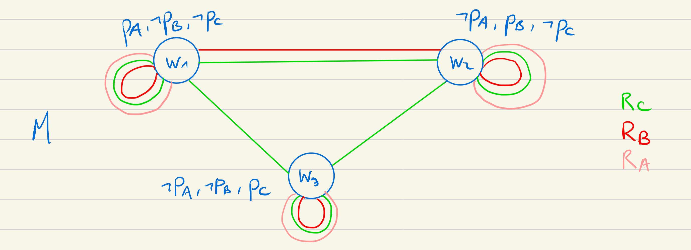
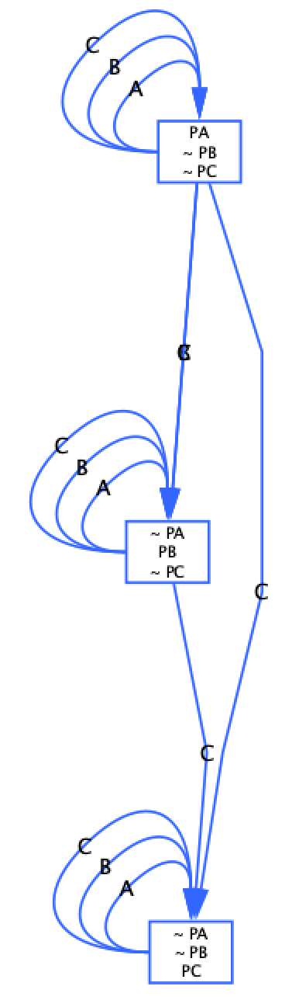
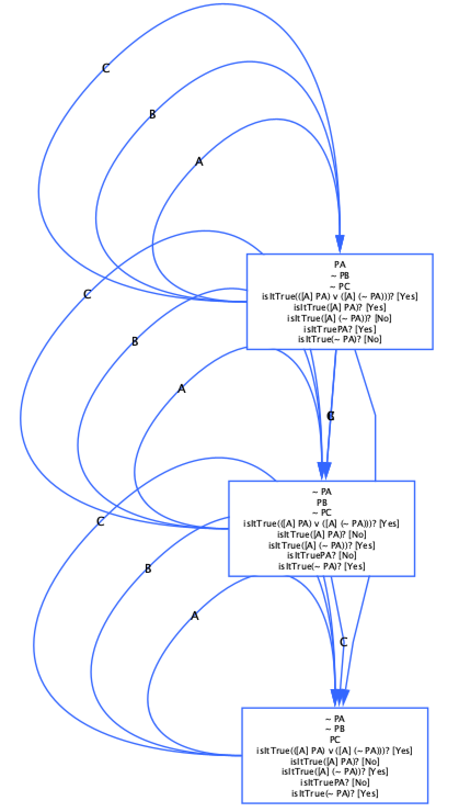
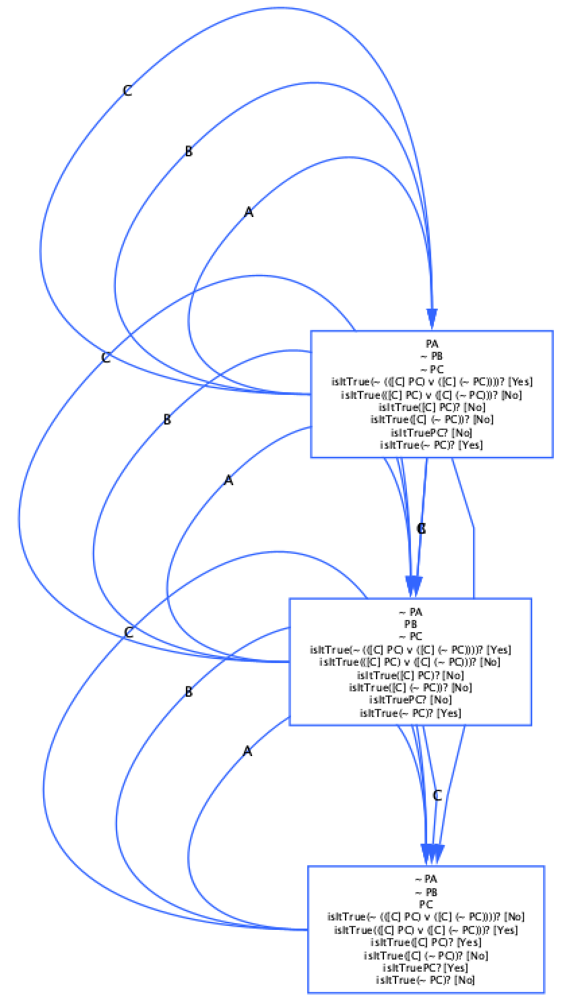
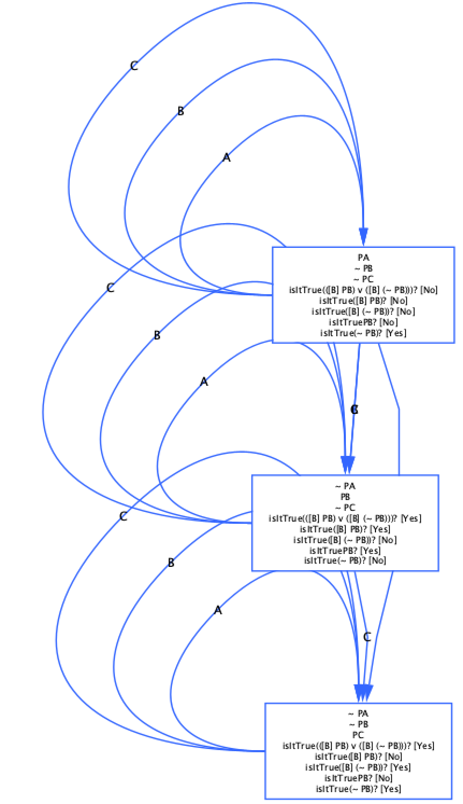
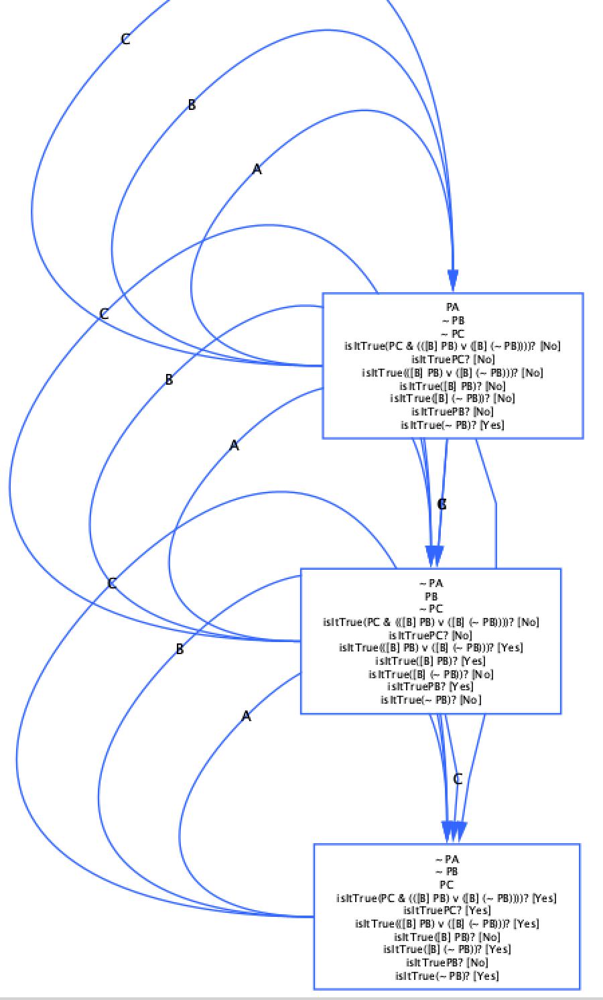
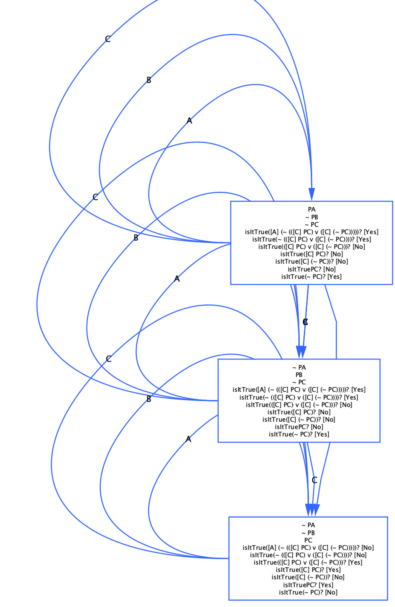
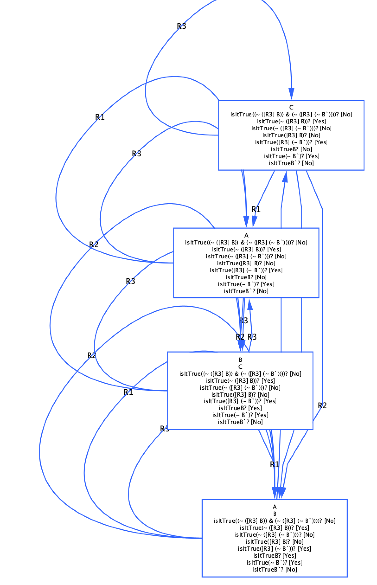
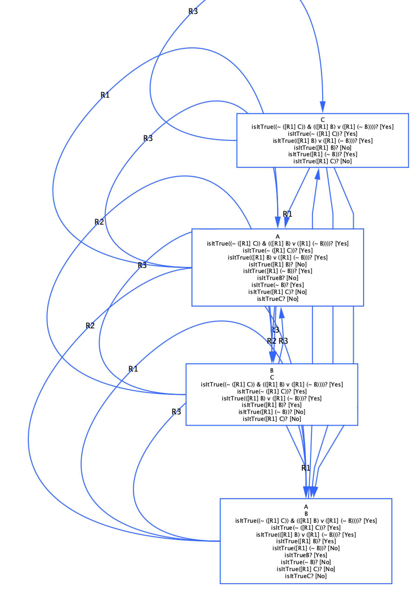
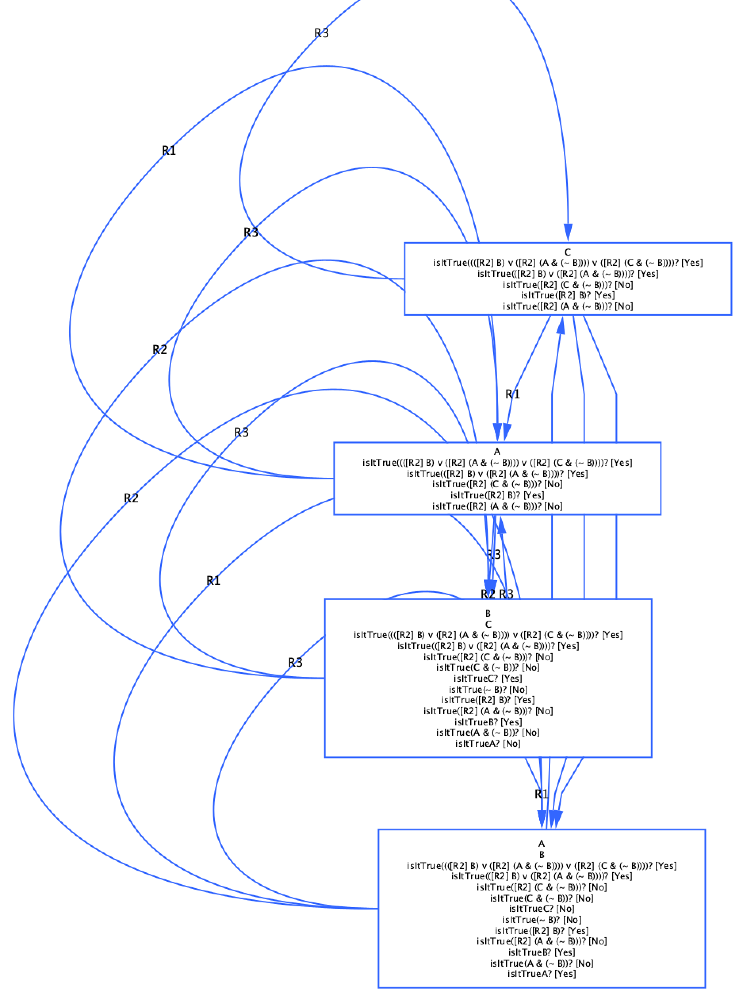

# LRC - TME 7
-----------------------
#### Ruizheng Xu 21111473  
-----------------------

## Exercice 1

#### Question 1

1)

`imp nec P not nec not nec P`

Toutes les feuilles sont ouvertes donc la formule est satisfiable, on regarde ensuite si la négation de la formule est insatisfiable pour déterminer si notre formule est valide ou seulement satisfiable.

`not imp nec P not nec not nec P`

On obtient qu'une seule feuille et elle est fermée, donc la négation de la formule est insatisfiable, ce qui implique que notre formule est valide.

2)

`and nec P nec nec not P`

Toutes les feuilles sont fermées, donc la formule est insatisfiable.

3)

`imp nec P nec nec not P`

Toutes les feuilles sont ouvertes, donc la formule est satisfiable.
On regarde la négation de la formule :

`not imp nec P nec nec not P`

Toutes les feuilles sont ouvertes pour la négation, donc la formule est satisfiable.

#### Question 2

La stratégie de la logique de type S5 est de appliquer `CPLStrategy` qui consiste à transformer la formule en une jonction ou disjonction, puis de traiter chaque partie.
Ensuite, on applique le reste des stratégies, qui ajoute des mondes et les relie entre eux.

## Exercice 2

#### Question 1

`equiv not nec P nec not nec P`

Les feuilles sont ouvertes, donc la formule est satisfiable.

On vérifie la négation : `not equiv not nec P nec not nec P`

Les feuilles sont fermées, donc la formule est valide.

#### Question 2

Comme dans la stratégie S4, on a pas le connecteur `equiv`, alors on doit transformer la formule :
`equiv P Q` est équivalent à `and imp P Q imp Q P`.
Ainsi, notre formule devient : `and imp not nec P nec not nec P imp nec not nec P not nec P`

Les feuilles sont ouvertes, alors la formule est satisfiable.
On vérifie la négation :

Les feuilles sont toujours ouvertes, donc avec la stratégier S4, on peut que conclure que la formule est satisfiable.

## Exercice 3

#### Question 1

La structure de Kripke de l'exercice des trois femmes (A, B et C) sur l'escalier est modélisée ainsi :



En modifiant la règle `ExampleOfModelAndFormula`, on ajoute les actions suivantes :
- Ajouter les mondes avec w1 la femme A, w2 la femme B, w3 la femme C:
  - createNewNode w1
  - createNewNode w2
  - createNewNode w3
- Ajouter les relations entre les différents mondes :
  - link w1 w2 B
  - link w1 w2 C
  - link w1 w3 C
  - link w2 w3 C ...
- Ajouter l'information que possède chaque monde :
  - add w1 PA
  - add w1 not PB ...

Et on obtient une structure de Kripke qui ressemble à :



#### Question 2

Les formules à testées sont :
- `or nec A PA nec A not PA` (1)
- `not or nec C PC nec C not PC` (2)

Dans Lotrec, ces formules doivent être ajoutés de façon suivante :
- add w1 isItTrue or nec A PA nec A not PA (et aussi pour w2 et w3 puisqu'on regarde tous les mondes)
- add w1 isItTrue not or nec C PC nec C not PC (pareil pour w2 et w3)

Et on obtient pour (1) que dans chaque feuille, la formule est satisfaisante, donc elle est vrai.



Pour (2), la formule est fausse dans le monde w3.



#### Question 3

B peut toujours savoir si elle a le papillon sur la tête ou pas ? Pour connaître la réponse, on vérifie cette formule `or nec B PB nec B not PB` dans tous les mondes :



La formule n'est pas dans tous les mondes (elle est fausse dans le monde w1), donc B ne peut pas toujours savoir si elle a le papillon sur la tête.

Maintenant, si C a le papillon sur la tête, est-ce que B sait toujours si elle a le papillon sur la tête ? Pour résoudre ce problème, on vérifie la formule : `and PC or nec B PB nec B not PB`



La formule est fausse dans les mondes w1 et w2, donc si C a le papillon sur la tête, B ne peut pas déduire si elle ou A a le papillon sur la tête.

#### Question 4

On regarde la satisfiabilité du formule : `nec A not or nec C PC nec C not PC`



Il semble que la formule est fausse dans le monde w3, donc la formule n'est pas vérifiée, donc A ne sait pas que C ne siat pas si elle a un papillion sur la tête.

Rq : Ce résultat est surprenant car C ne devrait pas savoir si elle a le papillon sur la tête ou pas puisqu'elle ne sait rien et ne voit rien, donc elle doit toujours hésiter sur si le papillon est sur A ou B ou elle-même. Alors que la femme A voit tout, donc elle sait si c'est B ou C qui a le papillon, et si aucune entre elles l'ont, alors c'est elle-même qui l'a. Donc normalement A devrait savoir que C ne sait pas si elle a le papillon.

#### Question 5

...

## Exercice 4

#### Question 1

On crée d'abord la structure dans Lotrec :

```
createNewNode w1
createNewNode w2
createNewNode w3
createNewNode w4

add w1 B
add w1 C
add w2 A
add w2 B
add w3 A
add w4 C
```

Ensuite, notre structure doit vérifier les trois formules suivantes :

a)

`isItTrue and not nec R3 B not nec R3 not B`

Il suffit qu'on mette en relation pour chaque monde, vers un monde où il y a B et un autre qui n'a pas B.

```
link w1 w1 R3
link w2 w2 R3
link w3 w3 R3
link w4 w4 R3
link w1 w3 R3
link w3 w1 R3
link w2 w4 R3
link w4 w2 R3
```



Et notre structure renvoie vrai pour la formule a)

b)

`isItTrue and not nec R1 C or nec R1 B nec R1 not B`

Comme `or nec R1 B nec R1 not B` est toujours vrai, alors on doit juste satisfaire `not nec R1 C`. Pour cela, on ajoute une relation pour chaque monde, vers un monde où il n'y a pas c.

```
link w1 w2 R2
link w2 w2 R2
link w3 w3 R2
link w4 w3 R2
```



Et notre structure renvoie vrai pour la formule b)

c)

`isItTrue or or nec R2 B nec R2 and A not B nec R2 and C not B`

Il suffit d'ajouter une relation pour chaque monde vers un monde où il y a b, en effet, la formule est une disjonction, donc nous avons seulement besoin de satisfaire une des conditions, donc on prend la première `nec R2 B`.

```
link w1 w1 R1
link w2 w2 R1
link w3 w1 R1
link w4 w2 R1
```



Et notre structure renvoie vrai pour la formule c)